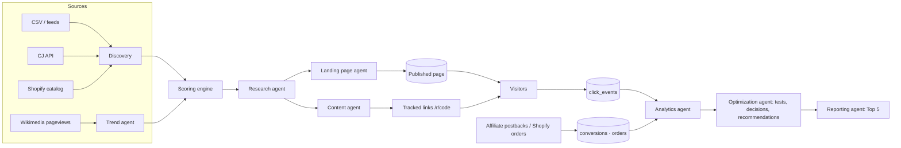

# Architecture

## Layers

```
src/
├── lib/          client-safe constants, RBAC table, utils, landing-section schemas
├── domain/       pure business logic — scoring, testing & decisions, cron, CSV, UTM, SEO, stats, trends, money
├── i18n/         EN/AR dictionaries, locale + currency resolution
├── server/       server-only code (guarded: importing it in the browser throws)
│   ├── db/           Drizzle schema, driver selection (Postgres | PGlite), migrations
│   ├── auth/         sessions, passwords (scrypt), API keys, route-handler wrapper
│   ├── security/     AES-GCM secrets, HMAC, SSRF-safe fetch, rate limiter
│   ├── services/     products, scoring, landing pages, content, affiliate, tracking, analytics,
│   │                 testing, recommendations, reports, experiments, articles, notifications, storefront
│   ├── discovery/    source adapters + discovery service
│   ├── ai/           provider interface, providers, routing/budget/cache service, template engine
│   ├── agents/       agent runtime, 9 agents, orchestrator, registry
│   ├── jobs/         queue, runner, cron scheduler, handlers
│   ├── integrations/ Shopify, social platforms, email, Telegram, status overview
│   └── command/      natural-language parser + executor
├── components/   admin (dark) + store (light) UI, charts
└── app/          routes: (store) storefront, /lp, /admin (shell), /api, /r
```

**Rules:** `domain/` has no I/O and is unit-tested exhaustively. Services take a `ServiceContext`
(`db`, `orgId`, `userId`, `role`, `actor`, `log`) so every query is tenant-scoped and every mutation
is permission-checked (`assertCan`). Pages, server actions and REST handlers are thin shells over
services — the same code path serves the UI, the API and the worker.



## Request paths

- **Storefront** (`/(store)`, `/lp`) — dynamic Server Components read the public read model
  (`services/storefront.ts`); a client beacon posts page views to `/api/track`; CTAs go through
  `/r/{code}` which logs the click (with UTMs and A/B variant) and redirects.
- **Command center** (`/admin/*`) — dark shell, session-authenticated Server Components; mutations
  are Server Actions that call services; long work is enqueued as jobs and watched from the UI.
- **REST** (`/api/v1/*`) — `apiRoute()` wrapper: session or `Bearer forge_…` API key, RBAC,
  rate limiting, JSON errors, request logging.
- **Webhooks** (`/api/webhooks/*`) — signature/token verified, idempotent.
- **Worker** — polls the Postgres job queue, runs handlers (agents), enqueues due cron schedules.

## Key decisions

| Decision | Why |
|---|---|
| Next.js 16 App Router, single app for storefront + admin + API | One deployable, shared services, Server Actions for forms, RSC for fast SSR |
| Admin under `/admin/*` (not `/products`) | The storefront owns `/products/[slug]`; the spec's admin paths are mounted under `/admin` |
| PostgreSQL + Drizzle; PGlite for dev/tests | Real Postgres semantics everywhere (SKIP LOCKED, DISTINCT ON, partial indexes) with zero-dependency local dev |
| Own job queue on Postgres (not Redis/BullMQ) | One fewer service; `FOR UPDATE SKIP LOCKED` scales horizontally; dedupe keys make cron safe with N workers |
| Provider-agnostic AI + deterministic template engine | The system must work without keys, in demo mode and when the budget is hit — and must never pass off a template as AI |
| Provenance on every metric | Section 39: real vs estimated vs AI vs manual vs demo must never be confused |
| First-party tracking, consent-gated visitor id, A/B variant carried in the CTA URL | Attribution without third-party trackers or extra cookies |
| Custom i18n (dictionaries + `dir`) instead of locale-prefixed routing | Keeps storefront URLs canonical; locale via cookie/Accept-Language; RTL via logical CSS |
| Org-scoped tables + stores | Multi-store/multi-org ready (section 42) without separate deployments |
| Money as `numeric(12,2)`, scores as float, events append-only | Correct sums, cheap scoring, auditable analytics |

## Tenancy

`organizations → users, stores, products, …`. Every service query filters by `ctx.orgId`. The
storefront resolves its organization by host (`stores.domain`) and falls back to the default org.
Products can be assigned to many stores (`product_stores`).

## Data quality

`products.field_provenance` maps each tracked field to `{ p, source, at }`. Weaker sources never
overwrite stronger ones (`applyProductFacts(..., { onlyIfWeaker })`). The scoring engine turns
provenance into a confidence value and the UI shows a provenance badge next to every signal.
